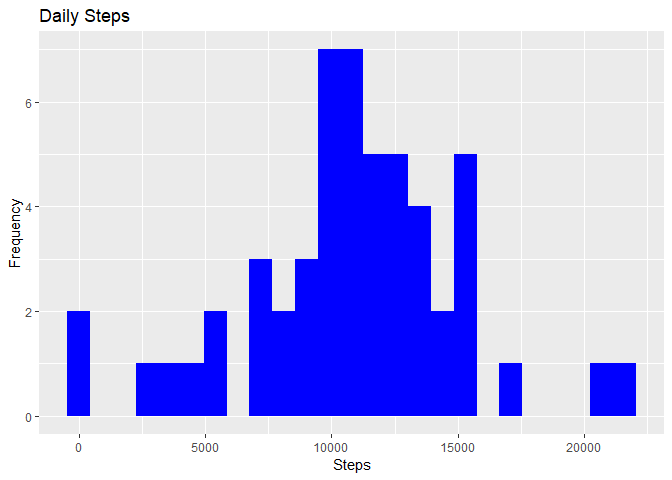
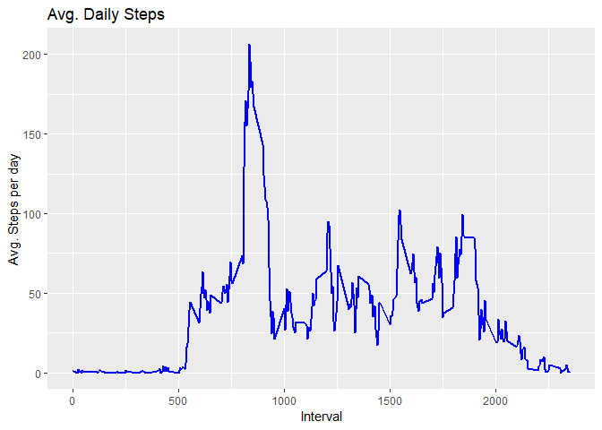

## download zip file containing data if it hasn't already been downloaded

```r
zipUrl <- "https://d396qusza40orc.cloudfront.net/repdata%2Fdata%2Factivity.zip"
zipFile <- "Activity Monitoring Data.zip"
if (!file.exists(zipFile)) {
  download.file(zipUrl, zipFile, mode = "wb")
}
```

## unzip zip file containing data if data directory doesn't already exist

```r
dataPath <- "Activity Monitoring Data"
if (!file.exists(dataPath)) {
  unzip(zipFile)
}
```

## Import data 

```r
activitydf <- read.csv("activity.csv")
# Format steps and date 
activitydf$date = as.Date(activitydf$date)
```

### 1. Calculate the total number of steps taken per day

```r
Total_Steps = activitydf %>%
  select(date, steps) %>%
  group_by(date) %>%
  summarize(steps = sum(steps))
head(Total_Steps,10)
```

```
## # A tibble: 10 x 2
##    date       steps
##    <date>     <int>
##  1 2012-10-01    NA
##  2 2012-10-02   126
##  3 2012-10-03 11352
##  4 2012-10-04 12116
##  5 2012-10-05 13294
##  6 2012-10-06 15420
##  7 2012-10-07 11015
##  8 2012-10-08    NA
##  9 2012-10-09 12811
## 10 2012-10-10  9900
```

### 2. Histogram of the total number of steps taken each day

```r
ggplot(Total_Steps, aes(x = steps)) +
  geom_histogram(fill = "blue", binwidth = 900) +
  labs(title = "Daily Steps", x = "Steps", y = "Frequency")
```

```
## Warning: Removed 8 rows containing non-finite values (stat_bin).
```

<!-- -->

### 3. Mean and median number of steps taken each day

```r
Total_Steps %>%
  select(steps) %>%
  summarise(Mean_Steps = mean(steps,na.rm=T),
            Media_Steps = median(steps, na.rm=T))
```

```
## # A tibble: 1 x 2
##   Mean_Steps Media_Steps
##        <dbl>       <int>
## 1     10766.       10765
```

### 4. Time series plot of the average number of steps taken

```r
Intervaldf = activitydf %>%
  select(steps, interval) %>%
  group_by(interval) %>%
  summarise(steps = mean(steps, na.rm=T))
ggplot(Intervaldf, aes(x = interval , y = steps)) + geom_line(color="blue", size=1) + labs(title = "Avg. Daily Steps", x = "Interval", y = "Avg. Steps per day")
```

<!-- -->

### 5. The 5-minute interval that, on average, contains the maximum number of steps

```r
Intervaldf %>%
  filter(steps == max(steps)) %>%
  select(interval) %>%
  summarize(max_interval = interval)
```

```
## # A tibble: 1 x 1
##   max_interval
##          <int>
## 1          835
```


### 6. Code to describe and show a strategy for imputing missing data
#### Using the mean value to fill NA

```r
sapply(activitydf,function(x) sum(is.na(x)))
```

```
##    steps     date interval 
##     2304        0        0
```

```r
newactivitydf = activitydf %>%
  mutate(steps = replace_na(steps,mean(steps,na.rm=T)))

sapply(newactivitydf,function(x) sum(is.na(x)))
```

```
##    steps     date interval 
##        0        0        0
```

```r
# Create a new dataset that is equal to the original dataset but with the missing data filled in.
# write.csv(newactivitydf,file='tidyData_activity.csv')
```

### 7. Histogram of the total number of steps taken each day after missing values are imputed

```r
Total_Steps = newactivitydf %>%
  select(date, steps) %>%
  group_by(date) %>%
  summarize(steps = sum(steps))

ggplot(Total_Steps, aes(x = steps)) +
  geom_histogram(fill = "blue", binwidth = 900) +
  labs(title = "Daily Steps", x = "Steps", y = "Frequency")
```

<!-- -->

```r
Total_Steps %>%
  select(steps) %>%
  summarise(Mean_Steps = mean(steps,na.rm=T),
            Media_Steps = median(steps, na.rm=T))
```

```
## # A tibble: 1 x 2
##   Mean_Steps Media_Steps
##        <dbl>       <dbl>
## 1     10766.      10766.
```

### 8.Panel plot comparing the average number of steps taken per 5-minute interval across weekdays and weekends

```r
activitydf <- read.csv("activity.csv")
activitydf = activitydf %>%
  mutate(steps = replace_na(steps,mean(steps,na.rm=T)),
         date = as.Date(date),
         `Day of week` = weekdays(date),
         `weekday or weekend` = ifelse(grepl(pattern = "Monday|Tuesday|Wednesday|Thursday|Friday",`Day of week`),"weekday", "weekend"),
         `weekday or weekend` = as.factor(`weekday or weekend`)) %>%
  select(everything()) %>%
  group_by(interval, `weekday or weekend`) %>%
  summarise(steps = mean(steps))

ggplot(activitydf , aes(x = interval , y = steps, color=`weekday or weekend`)) + geom_line() + labs(title = "Avg. Daily Steps by Weektype", x = "Interval", y = "No. of Steps") + facet_wrap(~`weekday or weekend` , ncol = 1, nrow=2)
```

<!-- -->

